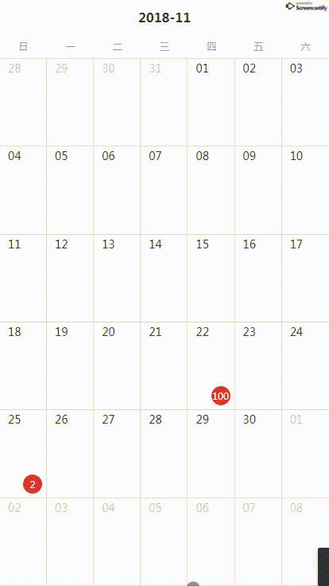

# v-calendar-slider

## 介绍
一个基于Vue，上下滑动切换月份日程管理组件

## DEMO


## 安装
```html
npm install --save v-calendar-slider
```

## 使用
```html
import calendarSlider from 'v-calendar-slider'

Vue.use(calendarSlider)

<calendar-slider :events="events" @monthChanged="monthChangedHandle" @dateClick="dateClickHandle"></calendar-slider>
```   

## Props
|prop|必选|类型|说明|
|:----    |:---|:----- |-----   |
|events   | false  | Array[Object]  | 事务列表 |
|defaultActiveMonth  | false  | String  |默认月份（YYYY-MM）  |

###prop: events 格式
```html
[
    {
        date: '2018-12-22',
        number: 2
    },
    {
        date: '2018-12-26',
        number: 2
    }
]
```   

## events
|名称|说明|回调参数|
|:----    |:---|:----- |
| dateClick  | 点击日期触发时间  |  点击的日期（YYYY-MM-DD） |
| monthChanged | slider切换后回调  | 切换后当前月份 （YYYY-MM） |
